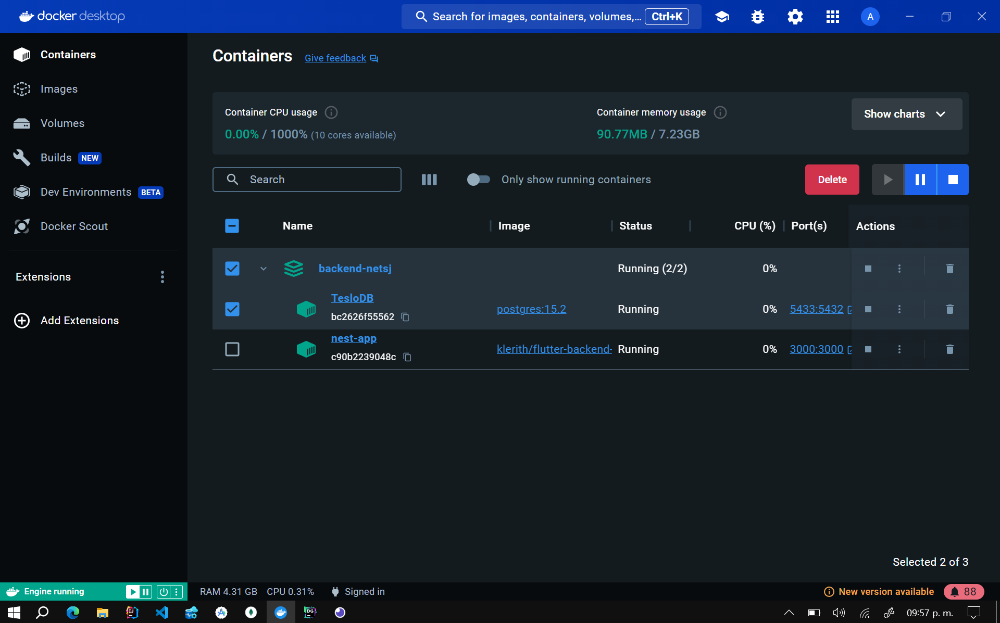

# **Select Language:** 🌍
- [Español (Spanish)](README-es.md)
- [English](README.md)

## Backend en Nets con Docker

Este proyecto es un backend desarrollado con NestJS y diseñado para una tienda llamada Teslo Shop. El backend proporciona una API para gestionar productos, usuarios y otros recursos relacionados. Se utiliza PostgreSQL como base de datos. El proyecto está encapsulado en un contenedor Docker para facilitar su despliegue y gestión.

## RESULTS
### Docker Up 
 
### Image PostgreSQL Up in Port 5433 
 

## Requisitos

- Docker
- Docker Compose

## Configuración del Proyecto

### Variables de Entorno

El proyecto requiere varias variables de entorno para su configuración. Puedes usar el archivo `env.template` como referencia. Aquí tienes un ejemplo de las variables necesarias:

```
APP_VERSION=0.0.1
STAGE=prod
DB_PASSWORD=MySecr3tPassWord@as2
DB_NAME=TesloDB
DB_HOST=TesloDB
DB_PORT=5432
DB_USERNAME=postgres
PORT=3000
HOST_API=http://localhost:3000/api
JWT_SECRET=Est3EsMISE3Dsecreto32s
```

### Archivos Necesarios

1. **docker-compose.yml**:
    ```yaml
    version: '3'

    services:

      app:
        container_name: nest-app
        image: klerith/flutter-backend-teslo-shop:0.0.7
        depends_on:
          - db
        ports:
          - ${PORT}:${PORT}
        environment:
          APP_VERSION: ${APP_VERSION}
          STAGE: ${STAGE}
          DB_PASSWORD: ${DB_PASSWORD}
          DB_NAME: ${DB_NAME}
          DB_HOST: ${DB_HOST}
          DB_PORT: ${DB_PORT}
          DB_USERNAME: ${DB_USERNAME}
          PORT: ${PORT}
          HOST_API: ${HOST_API}
          JWT_SECRET: ${JWT_SECRET}
      
      db:
        image: postgres:15.2
        restart: always
        ports:
          - "5433:5432"
        environment:
          POSTGRES_PASSWORD: ${DB_PASSWORD}
          POSTGRES_DB: ${DB_NAME}
        container_name: ${DB_NAME}
        volumes:
          - postgres-db:/var/lib/postgresql/data

    volumes:
      postgres-db:
        external: false
    ```

2. **env.template**:
    ```env
    APP_VERSION=0.0.1
    STAGE=prod
    DB_PASSWORD=MySecr3tPassWord@as2
    DB_NAME=TesloDB
    DB_HOST=TesloDB
    DB_PORT=5432
    DB_USERNAME=postgres
    PORT=3000
    HOST_API=http://localhost:3000/api
    JWT_SECRET=Est3EsMISE3Dsecreto32s
    ```

## Instrucciones de Uso

### 1. Clonar el Repositorio

Clona el repositorio en tu máquina local.

```sh
git clone https://github.com/Anyel-ec/Backend-NodeJS-Docker-Postgress-TO-Flutter
cd Backend-NodeJS-Docker-Postgress-TO-Flutter
```

### 2. Configurar Variables de Entorno

Crea un archivo `.env` en la raíz del proyecto y copia el contenido de `env.template` en él. Ajusta los valores según tus necesidades.

### 3. Levantar los Contenedores

Ejecuta el siguiente comando para levantar los contenedores:

```sh
docker-compose up -d
```

### 4. Inicializar la Base de Datos

Llena la base de datos con datos temporales accediendo a este enlace en tu navegador:

```
http://localhost:3000/api/seed
```

### 5. Documentación de la API

Encuentra la documentación de los puntos finales disponibles aquí:

```
http://localhost:3000/api
```

## Información Adicional

Este proyecto utiliza una imagen de Docker desarrollada por Fernando Herrera <3 (I love yours courses). Puedes encontrar más información sobre sus imágenes en [Docker Hub](https://hub.docker.com/u/klerith).

---

¡Gracias por utilizar este proyecto! Si tienes alguna pregunta o problema, no dudes en abrir un issue en el repositorio.