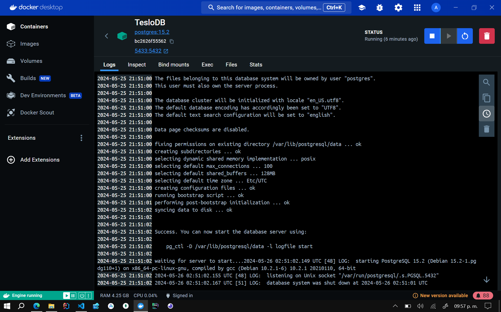

# **Select Language:** 🌍
- [Español (Spanish)](README-es.md)
- [English](README.md)

## Backend in Nets with Docker

This project is a backend developed with NestJS, designed for a store called Teslo Shop. The backend provides an API to manage products, users, and other related resources. PostgreSQL is used as the database. The project is encapsulated in a Docker container to facilitate deployment and management.

## RESULTS
### Docker Up 
 
### Image PostgreSQL Up in Port 5433 
 

## Requirements

- Docker
- Docker Compose

## Project Setup

### Environment Variables

The project requires several environment variables for configuration. You can use the `env.template` file as a reference. Here is an example of the necessary variables:

```
APP_VERSION=0.0.1
STAGE=prod
DB_PASSWORD=MySecr3tPassWord@as2
DB_NAME=TesloDB
DB_HOST=TesloDB
DB_PORT=5432
DB_USERNAME=postgres
PORT=3000
HOST_API=http://localhost:3000/api
JWT_SECRET=Est3EsMISE3Dsecreto32s
```

### Required Files

1. **docker-compose.yml**:
    ```yaml
    version: '3'

    services:

      app:
        container_name: nest-app
        image: klerith/flutter-backend-teslo-shop:0.0.7
        depends_on:
          - db
        ports:
          - ${PORT}:${PORT}
        environment:
          APP_VERSION: ${APP_VERSION}
          STAGE: ${STAGE}
          DB_PASSWORD: ${DB_PASSWORD}
          DB_NAME: ${DB_NAME}
          DB_HOST: ${DB_HOST}
          DB_PORT: ${DB_PORT}
          DB_USERNAME: ${DB_USERNAME}
          PORT: ${PORT}
          HOST_API: ${HOST_API}
          JWT_SECRET: ${JWT_SECRET}
      
      db:
        image: postgres:15.2
        restart: always
        ports:
          - "5433:5432"
        environment:
          POSTGRES_PASSWORD: ${DB_PASSWORD}
          POSTGRES_DB: ${DB_NAME}
        container_name: ${DB_NAME}
        volumes:
          - postgres-db:/var/lib/postgresql/data

    volumes:
      postgres-db:
        external: false
    ```

2. **env.template**:
    ```env
    APP_VERSION=0.0.1
    STAGE=prod
    DB_PASSWORD=MySecr3tPassWord@as2
    DB_NAME=TesloDB
    DB_HOST=TesloDB
    DB_PORT=5432
    DB_USERNAME=postgres
    PORT=3000
    HOST_API=http://localhost:3000/api
    JWT_SECRET=Est3EsMISE3Dsecreto32s
    ```

## Instructions for Use

### 1. Clone the Repository

Clone the repository to your local machine.

```sh
git clone https://github.com/Anyel-ec/Backend-NodeJS-Docker-Postgress-TO-Flutter
cd Backend-NodeJS-Docker-Postgress-TO-Flutter
```

### 2. Configure Environment Variables

Create a `.env` file in the root of the project and copy the contents of `env.template` into it. Adjust the values as needed.

### 3. Start the Containers

Run the following command to start the containers:

```sh
docker-compose up -d
```

### 4. Initialize the Database

Populate the database with temporary data by accessing this link in your browser:

```
http://localhost:3000/api/seed
```

### 5. API Documentation

Find the documentation of the available endpoints here:

```
http://localhost:3000/api
```

## Additional Information

This project uses a Docker image developed by Fernando Herrera (I love yours courses). You can find more information about his images on [Docker Hub](https://hub.docker.com/u/klerith).

---

Thank you for using this project! If you have any questions or issues, feel free to open an issue in the repository.
